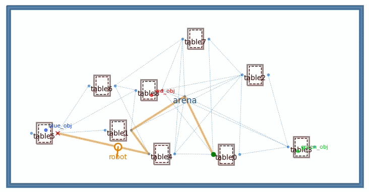

# Coding Interview Task

## Overview

You are given a 2D robot simulator with a 20×10 m arena containing 9 tables. Three colored objects — **red**, **blue**, and **green** — have been placed on random tables. Your task is to implement a search strategy that drives the robot to find the **green object**.



## Setup

From the workspace root, initialise the pyrobosim submodule, build, then install dependencies:

```bash
git submodule update --init --recursive
colcon build
source install/setup.bash
```

## Running the task

```bash
python3 task.py
```

This opens a GUI showing the arena, tables, and robot. Your `run_search` implementation runs in a background thread while the GUI renders the robot's motion in real time.

## Your task

Open `task.py` and implement the `run_search` function:

```python
def run_search(world: World) -> None:
    robot = world.robots[0]

    # Your code here
```

The function receives the fully initialised `world` object. The robot already has a path planner and executor attached — you only need to command it.

### Useful API

| Call | Description |
|---|---|
| `world.object_spawns` | List of all table spawn locations |
| `robot.navigate(goal="table0_tabletop")` | Navigate to a named location; blocks until complete |
| `robot.detect_objects()` | Detect objects at the robot's current location |
| `robot.last_detected_objects` | List of `Object` instances found by the last detection |
| `obj.viz_color` | RGB tuple `(r, g, b)` in range `[0, 1]` for a detected object |
| `result.status == ExecutionStatus.SUCCESS` | Check whether a navigation or detection call succeeded |


### Exit conditions

- Print a message and return when the green object is found.
- Print a message and return when all locations have been searched without finding it.

## Notes

- Object positions are randomised via a seed — the layout changes if you pass a different `seed` to `build_world()`.
- The search order is up to you; tables do not need to be visited in any particular sequence.
- You may use any control architecture of your choice.
